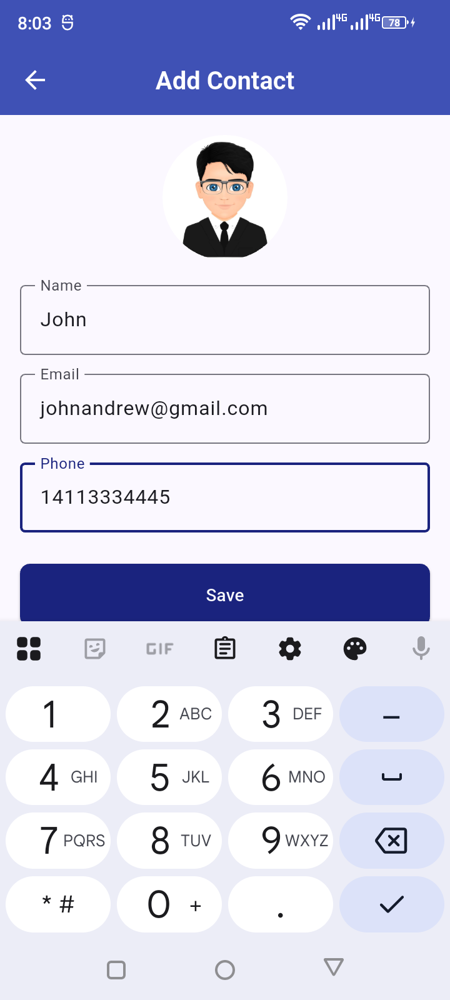
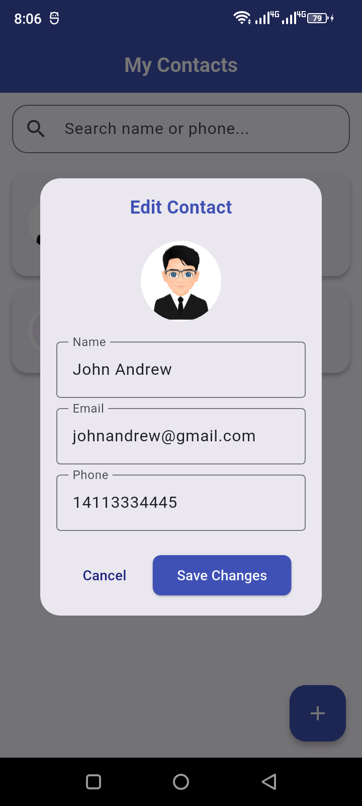
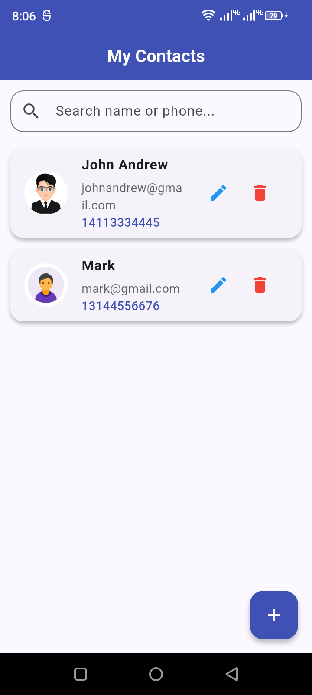

# 📱 contact_crud_app

A professional, high-performance **Contact Management Application** built using **Flutter** and **SQLite**. This app provides a seamless offline experience for managing contacts with a modern Material 3 interface.

## 🌟 Key Features

## 📸 App Screenshots

<p align="center">
  
  
  
</p>


- **Full CRUD Support:** Create, Read, Update, and Delete contacts with ease.
- **SQLite Persistence:** All data is stored locally using `sqflite`, ensuring your contacts remain accessible offline.
- **🔍 Real-time Search Filter:** Instantly find any contact by searching for their **Name** or **Phone Number**.
- **Tri-Field Display:** Organized UI layout showing **Name, Email, and Phone** in a clear, logical sequence.
- **Profile Image Integration:** Pick and display profile pictures from the **Device Gallery** using `image_picker`.
- **Material 3 Design:** A professional Deep Indigo (Navy) theme providing a branded and modern look.

## 📦 Dependencies Used
As defined in your `pubspec.yaml`:
- `sqflite`: Local SQLite database for mobile.
- `sqflite_common_ffi`: SQLite support for desktop/unit testing.
- `path`: For managing database file paths.
- `image_picker`: To select profile photos from the gallery.

## ⚙️ Setup Requirements (Permissions)
The app requires the following permission to access the device gallery on Android:

### 🤖 Android Setup
Add this line inside the `<manifest>` tag in `android/app/src/main/AndroidManifest.xml`:
```xml
<uses-permission android:name="android.permission.READ_EXTERNAL_STORAGE"/>
